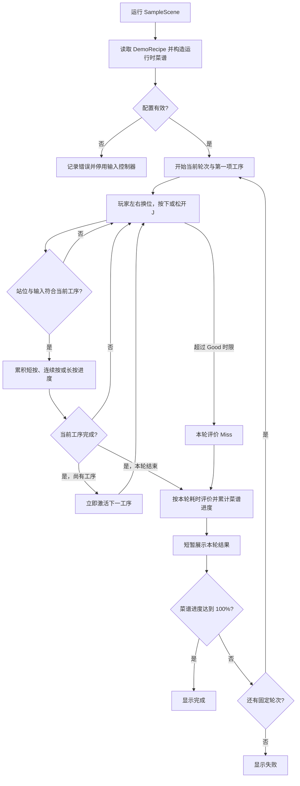
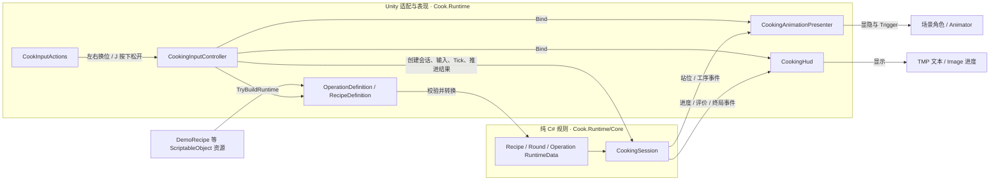
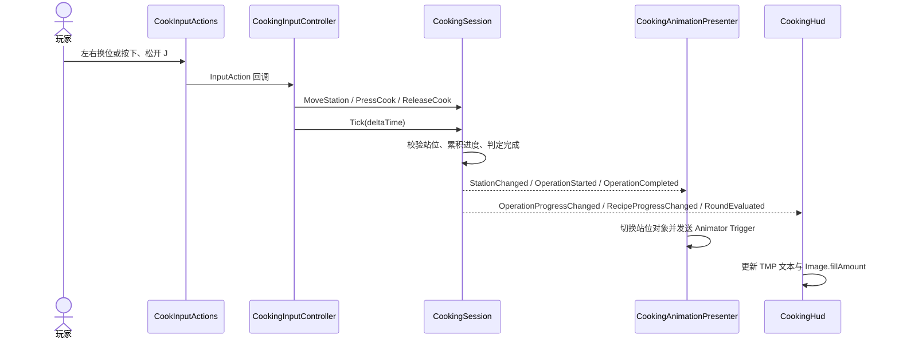
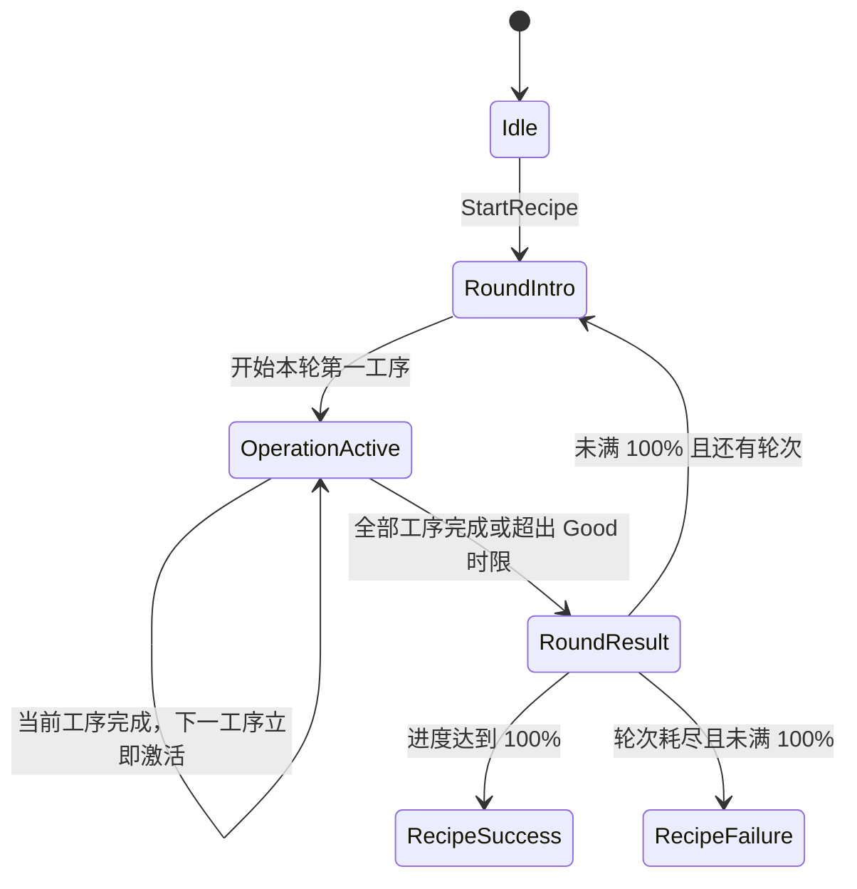
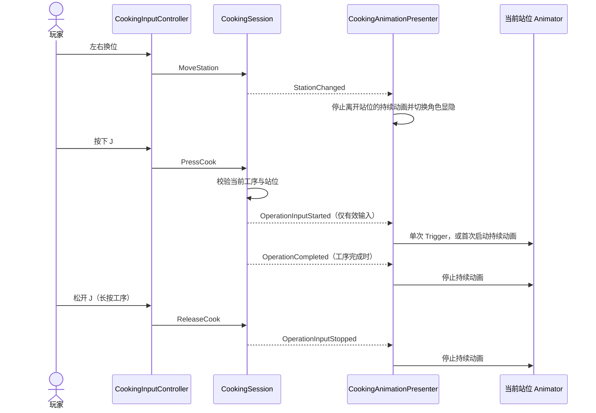

# Cook 架构图

本文记录已落地的架构快照、目标架构与玩家流程。架构版本只追加，不覆盖旧快照；计划中的能力必须与当前实现分开标注。

当前已实现版本：**V2**。完整游戏目标流程仍待定义。

## 完整游戏流程标杆（待定义）

完整游戏的局外入口、菜谱选择、关卡或存档规则尚未确定。当前仓库只有直接进入 `SampleScene` 的料理演示，所以下图是**已实现的 Demo 流程**，不是完整游戏承诺。未来确定完整业务流程后，在本节补充正式流程；若流程发生大改，同一提交追加架构版本。

### 当前 Demo 玩家流程

## 目标架构基线（待定义）

当前尚无经确认的完整游戏目标架构。现阶段只固定已经实现的边界：料理规则由纯 C# 核心拥有；Unity 配置负责把资源转成运行时数据；输入、场景对象、Animator 和 HUD 留在 Unity 适配与表现层。菜单、跨场景服务、存档和 Autoload 均**未实现，也未定义目标方案**。后续确定这些能力时，先明确生命周期与数据所有权，再追加新版本快照。

---

## V1：固定菜谱料理 Demo（2026-10-04）

对应代码基线：`efe3c5d`。料理功能目前是单场景、一道演示菜谱、六种工序、三轮固定顺序。料理运行时代码位于 `Cook.Runtime`；`Core` 是该程序集内不引用 Unity 的代码目录，尚未拆为独立程序集。

### 运行时目录与职责

| 位置 | 当前职责 |
|---|---|
| `Assets/Scripts/Cooking/Core` | `CookingSession` 持有状态、工序进度、轮次计时、评价与菜谱进度；`CookingTypes` 定义运行时数据和枚举。 |
| `Assets/Scripts/Cooking/Configuration` | `OperationDefinition`、`RecipeDefinition` 保存 ScriptableObject 配置，校验并转换成核心运行时数据。 |
| `Assets/Scripts/Input`、`Assets/Scripts/CookingInputController.cs` | Input Actions 与 MonoBehaviour 生命周期适配，把输入和 `deltaTime` 转交给核心，并在结果展示后推进轮次。 |
| `Assets/Scripts/Cooking/Presentation` | `CookingAnimationPresenter` 消费站位与工序事件；`CookingHud` 消费进度与结果事件。两者不决定玩法状态。 |
| `Assets/Cooking` | 六种工序资源与 `DemoRecipe` 固定轮次资源。 |
| `Assets/Animations`、`Assets/Fonts`、`Assets/Scenes` | 占位动画与 Animator Controller、TMP 字体、唯一可玩的 `SampleScene`。 |

`Assets/Editor/CookingDemoBuilder.cs` 是内容与场景的编辑器生成工具，`Assets/Tests` 保存 EditMode 和 PlayMode 测试；二者不属于运行时模块，也不出现在下方运行时依赖图中。

### 运行时模块边界与数据流

配置资源不在运行时被核心直接读取。核心不引用 Input System、MonoBehaviour、场景对象、Animator 或 UI；表现层只订阅核心事件，动画播放不反向驱动规则或工序切换。`CookingInputController` 是当前会话的场景级拥有者，退出场景后会话随对象销毁。

### 一次工序的运行流程

### 状态归属

- `CookingSession` 独占站位、当前轮次和工序、按键保持状态、计时、评价与菜谱进度。
- `CookingInputController` 只负责 Input System 回调、逐帧 `Tick` 和约 0.75 秒的结果展示等待。
- `CookingAnimationPresenter` 只负责三个站位角色的显隐及 Animator Trigger；目标工位未激活时，Trigger 在切换到该工位后发送。
- `CookingHud` 只显示工序顺序、Image 进度、评价与最终结果。

### 场景与生命周期现状

`EditorBuildSettings` 目前只启用 `Assets/Scenes/SampleScene.unity`。场景中的 `CookingGameplay` 持有输入控制器和动画表现组件，`CookingHUD` 持有 HUD；启动时从 `DemoRecipe` 构建运行时菜谱并创建 `CookingSession`。当前没有菜单入口、跨场景持久对象、Autoload、存档读写或结果持久化。成功或失败只显示在当前场景 HUD 中，不会记录到下次启动。

---

## V2：动画由烹饪输入驱动（2026-10-04，当前）

运行时模块、目录职责、会话状态归属、场景与存档生命周期沿用 V1。本版本调整 `CookingSession` 到 `CookingAnimationPresenter` 的事件流：切换站位会停止离开站位的持续动画并切换角色显隐；有效烹饪输入才启动当前工序动画。目标工位尚未激活时，不再预先发送 Animator Trigger。

连续按的首次有效按键启动持续动画，后续按键只累积玩法进度；离开工位或工序完成时停止。长按在松开、离开工位、工序完成或轮次结束时停止；再次按下才重新启动。`CookingSession` 仍只发布玩法事件，不引用 Animator。
