# Cook 架构图

本文记录已落地的架构快照、目标架构与玩家流程。架构版本只追加，不覆盖旧快照；计划中的能力必须与当前实现分开标注。

当前已实现版本：**V10**。下方 V1–V9 内容保留为历史快照；当前能力与目标流程见文末 V10。

## 完整游戏流程标杆（待定义）

> 以下初始流程与目标架构说明保留为 V1–V3 的历史记录，其中“当前”指当时版本。最新制作场景能力见 V10，目标经营流程见 V4；完整终局和存档规则仍待定义。

完整游戏的局外入口、菜谱选择、关卡或存档规则尚未确定。当前仓库只有直接进入 `GameDemo` 的料理演示，所以下图是**已实现的 Demo 流程**，不是完整游戏承诺。未来确定完整业务流程后，在本节补充正式流程；若流程发生大改，同一提交追加架构版本。

### 当前 Demo 玩家流程

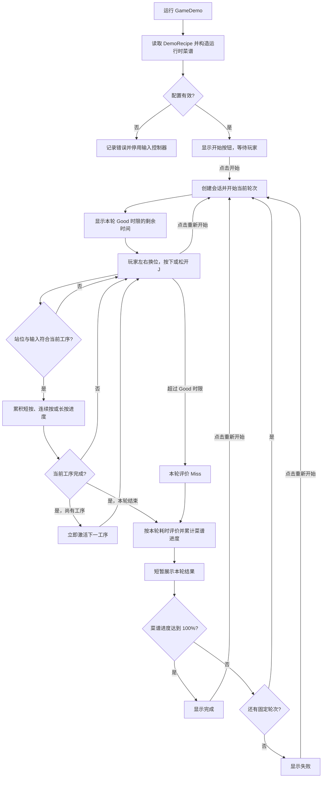

## 目标架构基线（待定义）

当前尚无经确认的完整游戏目标架构。现阶段只固定已经实现的边界：料理规则由纯 C# 核心拥有；Unity 配置负责把资源转成运行时数据；输入、场景对象、Animator 和 HUD 留在 Unity 适配与表现层。菜单、跨场景服务、存档和 Autoload 均**未实现，也未定义目标方案**。后续确定这些能力时，先明确生命周期与数据所有权，再追加新版本快照。

---

## V1：固定菜谱料理 Demo（2026-10-04）

对应代码基线：`efe3c5d`。料理功能目前是单场景、一道演示菜谱、六种工序、三轮固定顺序。料理运行时代码位于 `Cook.Runtime`；`Core` 是该程序集内不引用 Unity 的代码目录，尚未拆为独立程序集。

### 运行时目录与职责

| 位置 | 当前职责 |
|---|---|
| `Assets/Scripts/Cooking/Core` | `CookingSession` 持有状态、工序进度、轮次计时、评价与菜谱进度；`CookingTypes` 定义运行时数据和枚举。 |
| `Assets/Scripts/Cooking/Configuration` | `OperationDefinition`、`RecipeDefinition` 保存 ScriptableObject 配置，校验并转换成核心运行时数据。 |
| `Assets/Scripts/Input`、`Assets/Scripts/CookingInputController.cs` | Input Actions 与 MonoBehaviour 生命周期适配，把输入和 `deltaTime` 转交给核心，并在结果展示后推进轮次。 |
| `Assets/Scripts/Cooking/Presentation` | `CookingAnimationPresenter` 消费站位与工序事件；`CookingHud` 消费进度与结果事件。两者不决定玩法状态。 |
| `Assets/Cooking` | 六种工序资源与 `DemoRecipe` 固定轮次资源。 |
| `Assets/Animations`、`Assets/Fonts`、`Assets/Scenes` | 占位动画与 Animator Controller、TMP 字体、唯一可玩的 `SampleScene`。 |

`Assets/Editor/CookingDemoBuilder.cs` 是内容与场景的编辑器生成工具，`Assets/Tests` 保存 EditMode 和 PlayMode 测试；二者不属于运行时模块，也不出现在下方运行时依赖图中。

### 运行时模块边界与数据流

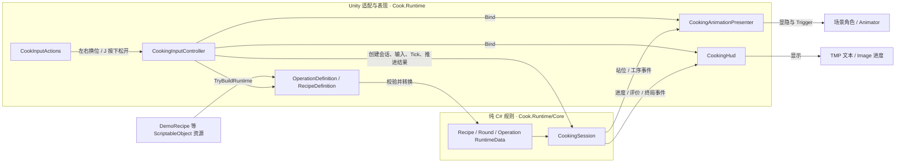

配置资源不在运行时被核心直接读取。核心不引用 Input System、MonoBehaviour、场景对象、Animator 或 UI；表现层只订阅核心事件，动画播放不反向驱动规则或工序切换。`CookingInputController` 是当前会话的场景级拥有者，退出场景后会话随对象销毁。

### 一次工序的运行流程

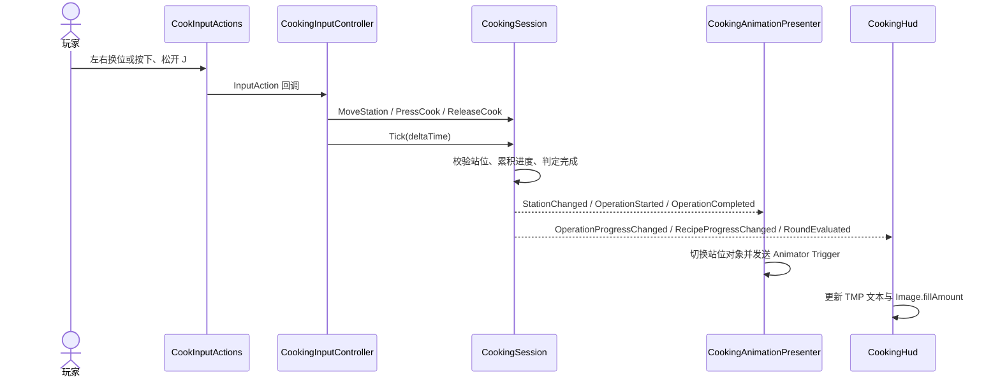

### 状态归属

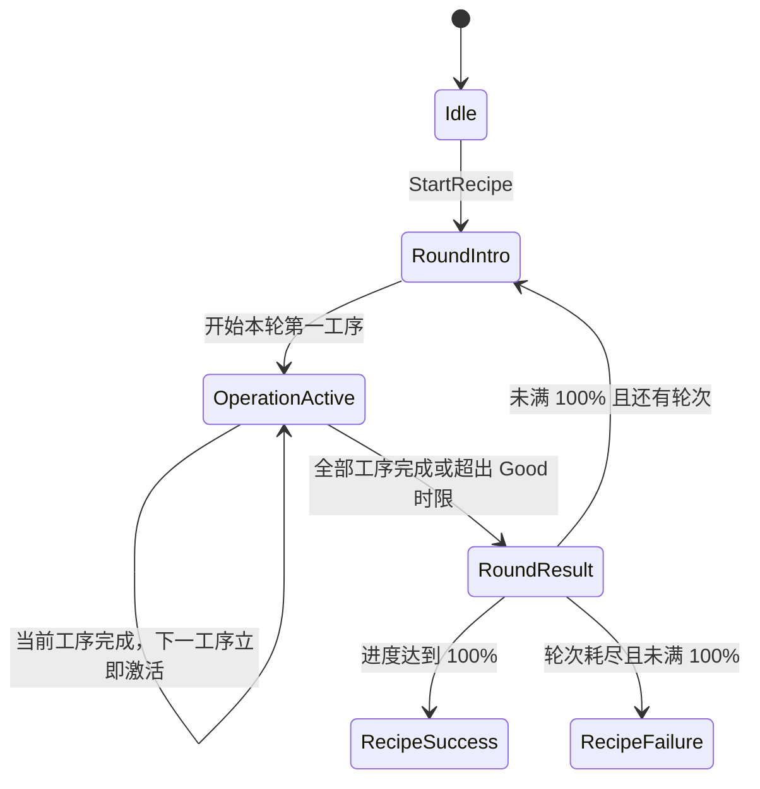

- `CookingSession` 独占站位、当前轮次和工序、按键保持状态、计时、评价与菜谱进度。
- `CookingInputController` 只负责 Input System 回调、逐帧 `Tick` 和约 0.75 秒的结果展示等待。
- `CookingAnimationPresenter` 只负责三个站位角色的显隐及 Animator Trigger；目标工位未激活时，Trigger 在切换到该工位后发送。
- `CookingHud` 只显示工序顺序、Image 进度、评价与最终结果。

### 场景与生命周期现状

`EditorBuildSettings` 目前只启用 `Assets/Scenes/SampleScene.unity`。场景中的 `CookingGameplay` 持有输入控制器和动画表现组件，`CookingHUD` 持有 HUD；启动时从 `DemoRecipe` 构建运行时菜谱并创建 `CookingSession`。当前没有菜单入口、跨场景持久对象、Autoload、存档读写或结果持久化。成功或失败只显示在当前场景 HUD 中，不会记录到下次启动。

---

## V2：动画由烹饪输入驱动（2026-10-04，当前）

运行时模块、目录职责、会话状态归属、场景与存档生命周期沿用 V1。本版本调整 `CookingSession` 到 `CookingAnimationPresenter` 的事件流：切换站位会停止离开站位的持续动画并切换角色显隐；有效烹饪输入才启动当前工序动画。目标工位尚未激活时，不再预先发送 Animator Trigger。

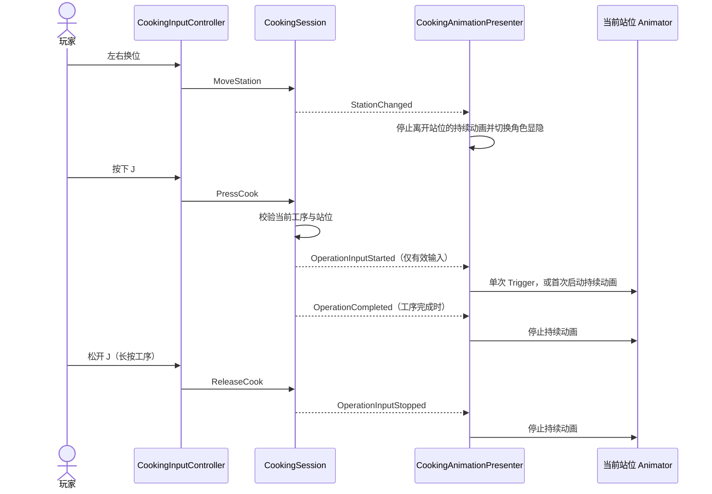

连续按的首次有效按键启动持续动画，后续按键只累积玩法进度；离开工位或工序完成时停止。长按在松开、离开工位、工序完成或轮次结束时停止；再次按下才重新启动。`CookingSession` 仍只发布玩法事件，不引用 Animator。

---

## V3：开始、重新开始与回合倒计时（2026-10-04，当前）

场景资源改名为 `GameDemo`，入口的构建设置指向该场景。运行时模块边界与核心计时规则沿用 V2；新增 Demo 的开始等待阶段。`CookingInputController` 在场景启动时只校验并缓存菜谱，点击“开始”后才创建 `CookingSession`。HUD 的按钮事件由控制器接收；“重新开始”在运行中或终局后创建新会话，旧会话从 HUD 和动画表现层解绑。

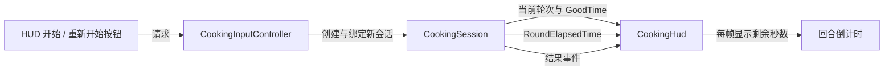

倒计时只在 `OperationActive` 阶段显示，取 `max(0, GoodTime - RoundElapsedTime)`；轮次评价与超时仍由核心会话决定。当前无跨场景状态、存档或 Autoload，重新开始只重置本场景的演示会话。

---

## V4：新制作数据配置起步（2026-10-06，当前）

### 当前已实现

构建入口改为 `Assets/Scenes/GameScene.unity`，旧的 `SampleDemo.unity` 不再保留。`GameScene` 仍挂载旧 Demo 的 `CookingInputController`、`CookingSession` 与 HUD，当前可运行逻辑仍是 V3 的固定料理流程；场景中的新 2D 角色和布景尚未接入新的制作规则。

`Cook.Configuration` 新增 `DishCatalogDefinition`、`DishDefinition`、`ProductionOperationCatalogDefinition` 和 `ProductionOperationDefinition`。目录目前包含一份练习菜和九种“工位 × 交互方式”操作资源。配置转换为 `Cook.Core` 的只读 `DishRuntimeData`、`ProductionRunData` 与 `ProductionOperationData`；每道工序的最长时限由 `60 秒 / 工序数` 计算。这些新数据**尚未由场景控制器读取**，不构成可玩的新制作系统。旧 Demo 配置资源仅因当前场景仍有引用而暂时存在，迁移场景后移除。

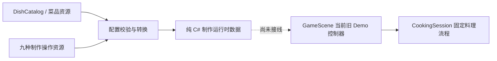

目前没有完整游戏会话、菜单选菜、售卖、经济循环、跨启动存档或 Autoload。

### 目标流程（策划已明确的部分，尚未实现）

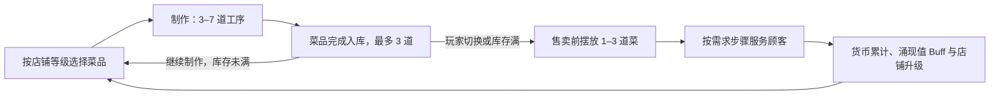

制作中的每道工序在完成 3 个实际操作或倒计时归零时结束；制作中允许切换，未完成进度暂不保留。操作偏离的计数、菜品定价公式和售卖数值仍待确定。目标实现将由纯 C# 会话拥有制作、库存与售卖状态，场景控制器只路由输入，UI 与动画消费状态变化；这些模块目前**均未落地**。存档生命周期和游戏终局尚未定义。

---

## V5：独立制作核心会话（2026-10-06，当前）

### 当前已实现

`Assets/Scripts/Cooking/Core` 新增纯 C# 的 `ProductionSession` 与 `ProductionResult`。一份会话负责一道菜的工序索引、倒计时、实际操作记录以及完成 / 取消状态，不依赖 Unity、输入系统、UI、动画或场景对象。V4 的配置资源转换为 `DishRuntimeData` 后，可以直接创建这份会话。

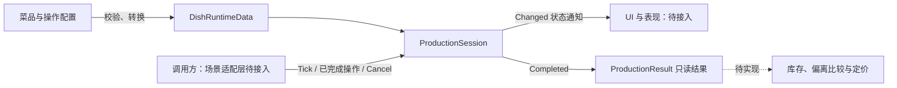

核心只接收识别完成的“工位 × 交互方式”操作；三连击整体计作一步。原始按键的单击等待、连击间隔、长按 3 秒与未完成输入的丢弃属于后续输入识别层。核心不检查操作是否遵循指引，也不生成 Excellent / Good 等评价。

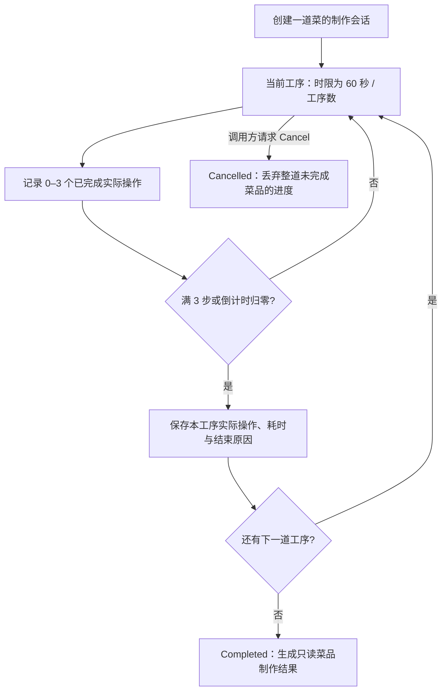

- `ProductionSession` 独占制作状态，调用方提交操作、推进时间和请求取消。操作满三步时立即推进；超时时剩余帧时间继续用于下一道工序。
- `ProductionRunResult` 保存每道工序的实际操作、耗时与结束原因；`ProductionResult` 同时保留菜品的指引配置，供后续偏离比较使用，当前不计算偏离、涌现值或价格。
- 完成后不再接受操作或推进计时；取消后清空已完成工序和当前工序的记录，不产生完成结果。完成结果由会话发布给调用方，库存接收逻辑尚未实现。
- 工位切换与制作 / 售卖阶段切换由未来场景控制器处理。核心提供取消能力，但当前没有实现切换输入到取消的路由。

`GameScene` 仍使用 V4 所述的旧 Demo 控制器与 HUD，**尚未调用新制作会话**。九种操作资源与练习菜仍是 V4 的配置。输入识别、菜单、容量为 3 的库存、售卖、Buff、经济、升级与存档均未接入；目标完整流程沿用 V4，偏离比较和售卖细节仍待确定。新增测试位于 `Assets/Tests/EditMode/ProductionSessionTests.cs`，编辑器测试和工具脚本不属于运行时模块边界。

---

## V6：入口、输入、UI 与音效适配代码（2026-10-06，当前）

### 当前已实现

参考本地 `system-game-managers` Kit，新增 `Cook.Managers.GameManager` 作为唯一 MonoBehaviour 单例入口；内部创建普通类 `GameInputManager`、`GameUIManager` 和 `GameAudioManager`。入口显式配置，不在访问 Instance 时自动创建对象。重复入口直接退出初始化；主入口负责输入启停与销毁、UI 注册表清理和音效停止。入口对象设计为跨场景持久化，具体场景面板仍由场景持有。

- `Assets/Scripts/Managers`：Unity 服务的初始化、生命周期、输入适配、面板注册和音频播放。
- `Assets/Scripts/UI`：`BasePanel` 提供显示 / 隐藏能力；当前 `CookingHud` 已继承它，玩法显示逻辑仍消费旧 `CookingSession`。
- `Assets/Scripts/Input`：`CookInputActions` 保持原配置；`OperationInput` 是纯 C# 输入识别规则，不引用 Unity、工位、UI 或制作会话。输入适配器额外绑定 Space，原 J 和左右换位按键仍有效。
- `CookingInputController` 改为取得入口的输入服务，订阅按下、松开和换位事件；通过 UI 服务注册场景 HUD，播放开始、操作完成和菜品完成音效。控制器不再创建或销毁 Input Actions。

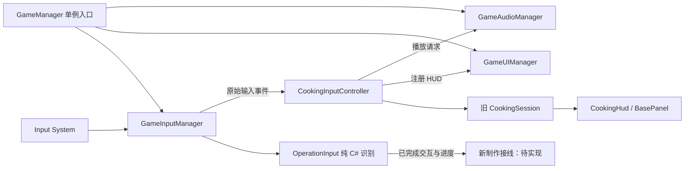

输入识别接受短按、三連击与 3 秒长按。单击等待连击窗口结束后确认；两下超时丢弃，三下整体完成一次。连击间隔默认 0.35 秒，可在入口配置。暂用该间隔作为短按最大按住时长；超出后视为长按候选，未到 3 秒松开丢弃，这是当前适配参数，不是策划最终规定的短按时长。换位、重启或禁用输入时清除未完成输入，不保留输入进度。

UI 只管理已注册面板，不加载资源，不持有跨场景 Canvas；场景控制器销毁时注销 HUD。音效管理器接收 AudioSource 和 AudioClip，不查询玩法状态或 UI；提供循环 BGM、UI 音效与场景音效播放，暂无混音设置和渐变。此版本未引入 Addressables、UniTask、Cinemachine、全局事件总线或 RPG 背包代码。

本快照包含代码适配，`GameScene` 尚未添加入口组件，下一步完成场景绑定。`ProductionSession` 仍是 V5 的独立核心，尚未消费新的交互识别事件；菜单、店铺经营、库存、售卖与存档继续待实现。编辑器工具与测试属于开发支持，不纳入运行时模块。

---

## V7：GameScene 接入统一管理入口（2026-10-06，当前）

`Assets/Scenes/GameScene.unity` 新增根对象 `GameManager`，挂载 V6 的入口组件。入口在场景控制器之前初始化，并在切换场景时保留；重复入口不会重新创建服务。入口没有自动创建隐式兜底，其他独立场景需要明确配置入口或通过已有入口进入。

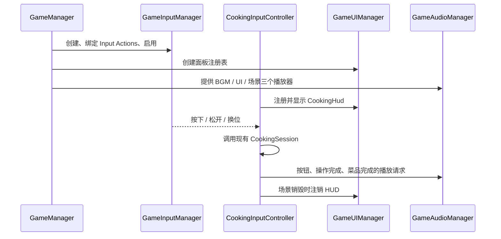

三个音频播放器在未配置引用时由入口创建，默认使用 2D 声音，不自动播放。按钮、操作完成和菜品完成的 AudioClip 当前留空，可以在场景入口 Inspector 配置；已有音效触发调用，但本版本未导入声音素材，因此默认无声。

UI 与音效不拥有玩法状态；新的 `OperationInput` 只输出交互类型与进度，工位归属仍由场景控制器决定。当前场景使用输入管理器的原始事件连接旧 `CookingSession`，新制作规则和识别进度条仍待下一步迁移；不应将当前场景描述为已实现策划案完整制作。其他模块与目标完整流程沿用 V5 / V6，库存、店铺、售卖和存档尚未实现。

---

## V8：类型化公共事件管理器（2026-10-06，当前）

`Cook.Managers.EventManager` 是不依赖 Unity 和具体业务的普通 C# 类，使用 `Dictionary<Type, Delegate>` 保存订阅。`GameManager` 在创建输入等服务之前创建它，通过 `GameManager.Instance.Events` 提供访问；唯一入口销毁时清空订阅。它是公共通信设施，不拥有制作、售卖、库存或店铺状态。

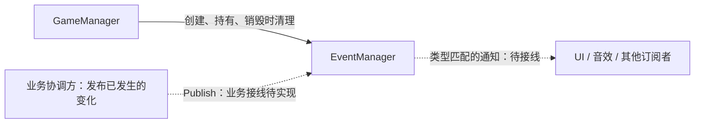

接口是 `Subscribe<T>(Action<T>)`、`Unsubscribe<T>(Action<T>)`、`Publish<T>(T)` 和 `Clear()`。事件类型同时定义名称和载荷；没有字符串事件名、按参数数量划分的包装类、事件队列或反射派发。

- 同步在调用线程执行，供 Unity 主线程使用；不提供线程同步。发布按订阅顺序调用，依据泛型类型精确匹配，不自动通知父类或接口订阅。
- 派发时使用当前委托快照；回调中新增或退订不影响本次已确定的名单，后续发布使用更新后的订阅。嵌套发布立即执行。
- 与 C# 事件一致：重复订阅会重复通知，一次退订移除一次；回调异常向调用方传播并中止本轮后续通知，不隐藏异常。
- 场景订阅者应在停用或销毁时退订；全局入口持久化，不会在场景切换时自动清空所有订阅。退订应使用原方法或保留的委托引用。

示例调用是 `GameManager.Instance.Events.Subscribe<DishProduced>(OnDishProduced)`，其中 `DishProduced` 只是未来业务事件的示意，当前没有创建该类型或发布菜品入库事件。现有会话内部仍使用 C# 事件；未来由控制器在完成实际业务变更后转发跨模块通知。开始制作、入库和切换阶段等请求仍通过明确的方法调用处理。

当前新增的是事件服务及其生命周期接入，已有 UI、音效、输入和会话通知没有改为公共事件。场景仍使用 V7 的旧制作会话；制作迁移、库存、售卖、店铺与存档继续待实现。测试位于 `Assets/Tests/EditMode/EventManagerTests.cs`，属于开发支持。

---

## V9：新制作场景适配代码（2026-10-06，当前）

本次迁移的代码快照：`CookController` 替代 `CookingInputController`，场景核心改为 `ProductionSession`；`CookHud`、`CookAnimationPresenter` 替代原 HUD 与动画表现类。原控制器、HUD、动画组件的脚本 GUID 保留，以迁移场景引用；旧 `CookingSession`、类型与配置代码、旧 Demo Builder 及已失效测试移除。场景资源更新由 `CookSceneBuilder` 完成，本快照尚未执行生成与绑定，暂不能直接试玩。

控制器负责读取练习菜、创建 / 取消 / 重启制作、提交识别完成的操作及转发会话事件。UI 和动画通过公共事件订阅状态；音效由 `GameManager` 将开始、操作完成与菜品完成事件转为播放请求。`ProductionStarted`、`ProductionChanged`、`ProductionFinished`、`StationChanged` 与输入表现事件均只含纯 C# 数据，不引用 Unity 场景对象。

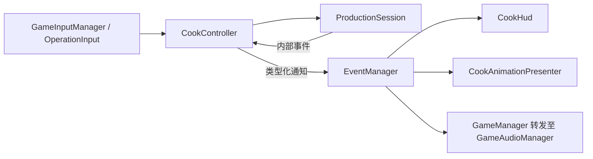

玩家已确认：左右换工位清除未完成输入，保留本工序实际步骤；离开制作阶段取消整道未完成菜品。三个工位仍各有角色，切换通过显隐完成，不改为单角色移动；切换不触发 Tap 或 Hold。跨工序、终止或重启时清理输入，避免迟到的单击写入下一工序。输入识别在制作计时之后推进，焦点状态与玩法输入启用状态分开保存。

表现目标是 `CharacterVisual` 子对象的 XY 位移、缩放及 Z 轴摆动，待生成 Idle / Tap / Hold 三个 2D 占位片段与对应状态机。制作 HUD 显示指引、实际步骤、工序倒计时与输入进度，不含制作评分。库存、售卖、经营与存档依然未实现；完成制作仅输出结果并发布通知，不宣称已入库。

---

## V10：新制作场景与 2D 演示动画接通（2026-10-06，当前）

### 当前运行时架构与数据流

下图只包含已实现的运行时模块；编辑器工具与测试不纳入模块边界。

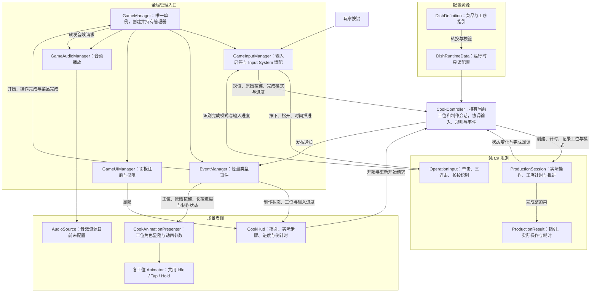

- 制作逻辑已经支持三个工位 × 单击、三连击、长按，共九种操作组合。`OperationInput` 只识别交互模式；`CookController` 将模式与当前工位组合后提交给 `ProductionSession`。
- 动画表现尚未分别映射九种组合。`CookAnimationPresenter` 接收原始按下、松开和输入进度事件，按下时触发 Tap，长按进度期间设置 Holding；单击与三连击共用 Tap，三个工位共用同一套占位片段。它目前没有订阅 `OperationPerformed` 来区分九种已完成操作。
- 工位切换通过三个角色根对象的显示与隐藏完成，当前工位显示，其他工位隐藏。
- `GameManager` 是服务入口，不拥有制作业务状态；音效通知由它转发给 `GameAudioManager`。库存、售卖、Buff、经济、升级和存档尚未接入运行流程。

### 当前已实现

`GameScene` 已使用 `CookController`、`ProductionSession`、`CookHud` 和 `CookAnimationPresenter`，不再运行旧 `CookingSession`。控制器从 `PracticeDish.asset` 构建菜品数据；开始后接受任意工位的单击、三连击或 3 秒长按。每道工序最多记 3 个实际操作，达到 3 步或时限归零立即推进，最后一道结束生成结果。菜单尚未实现，当前入口仍固定为练习菜；库存未实现，完成通知不是入库通知。

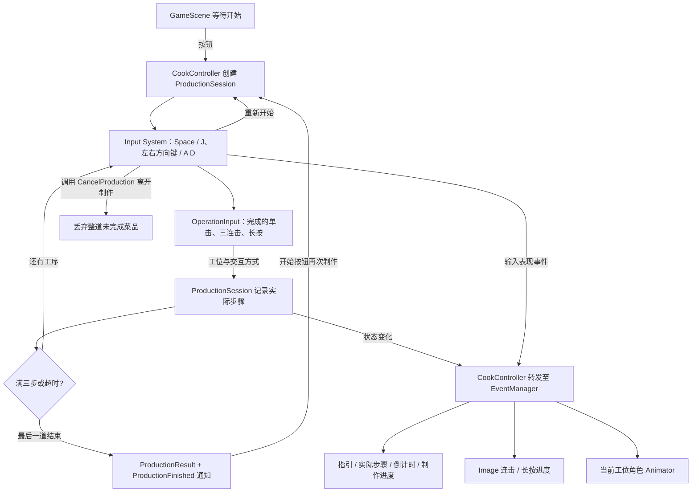

- `ProductionSession` 拥有制作状态；`OperationInput` 拥有未完成输入；`CookController` 拥有当前工位与会话生命周期。换工位仅清理未完成输入，保留实际步骤；跨工序、取消和重启也会重置未完成输入。
- 三个工位保留独立角色，通过根对象显隐切换；三个 Animator 引用均已绑定。换位先停止旧角色的持续状态并清除 Trigger，新工位不因切换而播放操作动画。
- `Cook2D.controller` 只包含 Idle / Tap / Hold 状态，参数为 Tap Trigger 和 Holding Bool。`Idle2D.anim`、`Tap2D.anim`、`Hold2D.anim` 只修改 `CharacterVisual` 的 XY 位移、缩放和 Z 轴摆动，不改变工位根节点，不使用 3D 翻转。`Character.prefab` 和场景实例都已使用该控制器。
- HUD 用 Image fill 展示输入和制作进度；制作中无 Excellent / Good 等评分。输入进度由识别器事件提供，制作进度按已结束工序及当前已完成步骤显示，不作为菜品成功 / 失败判定。
- 入口订阅制作开始、操作完成、菜品完成事件并转发给音效服务；音频片段仍留空，由 Inspector 配置。UI 和动画在停用时退订，场景控制器取消制作并释放输入订阅；新会话不会继续接受旧输入。

旧 Demo 菜谱、六种操作配置、十三个旧动画片段与旧控制器移除；九种新操作资源和练习菜保留。`CookSceneBuilder` 仅更新当前制作接线、2D 占位动画和 HUD 布局，不重建用户场景布景；编辑器工具不属于运行时模块。基础字集补入“砧”和箭头，TMP 缓存已更新。

### 仍待实现

选菜菜单、完成入库（容量 3）、售卖、店铺经营、偏离比较、涌现值、定价与存档。策划完整目标流程沿用 V4；本版本是可运行的制作演示，不宣称完整经营循环已实现。
